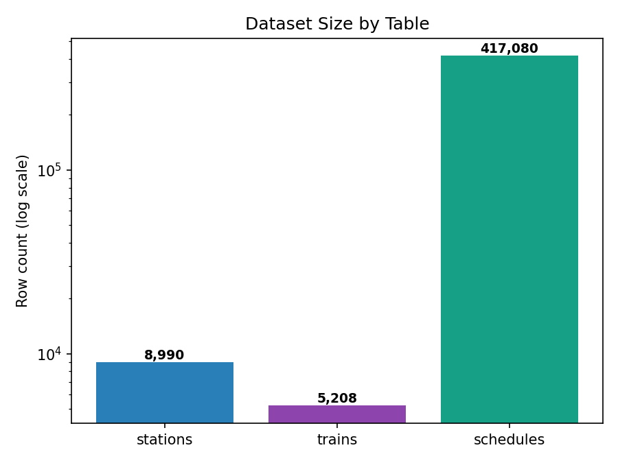
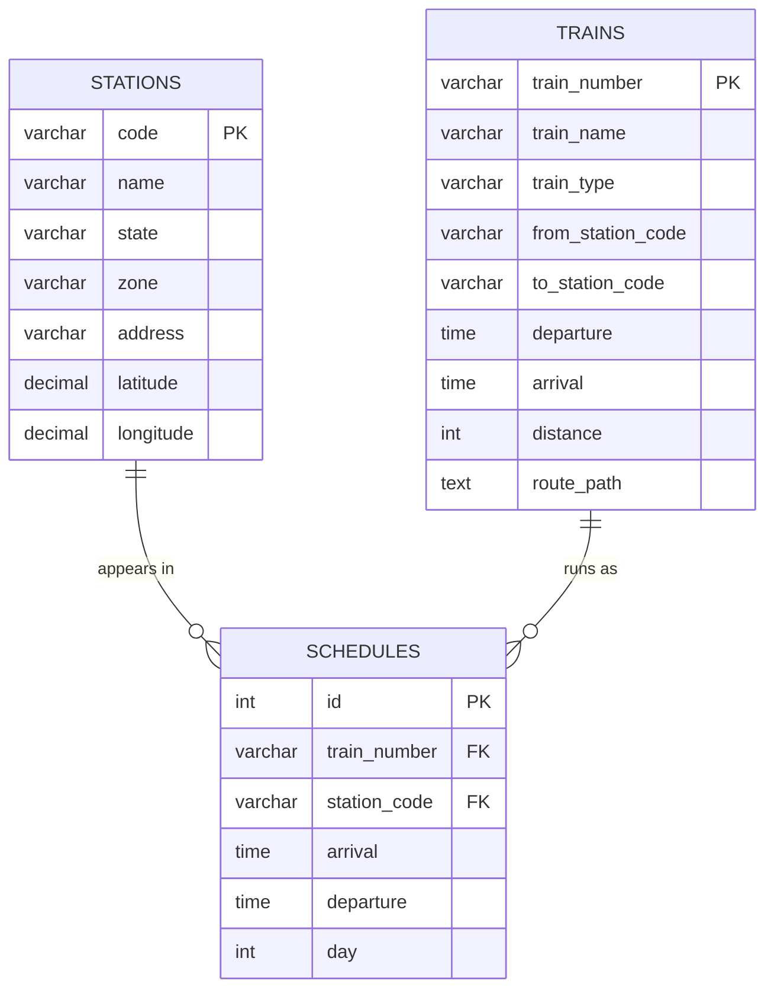
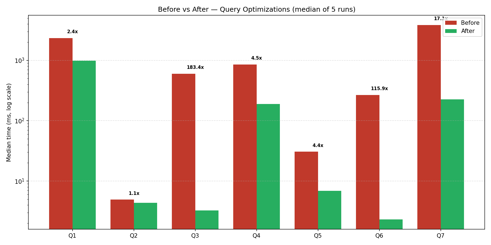
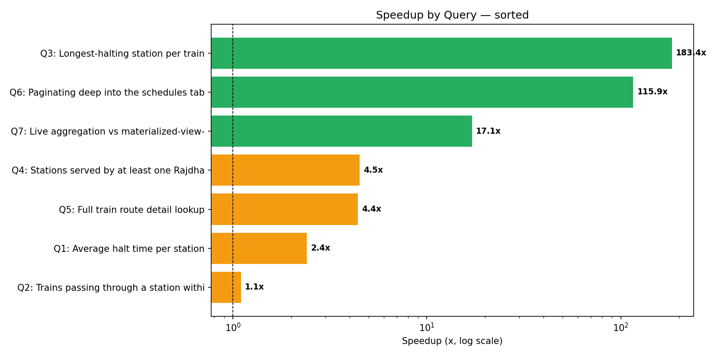
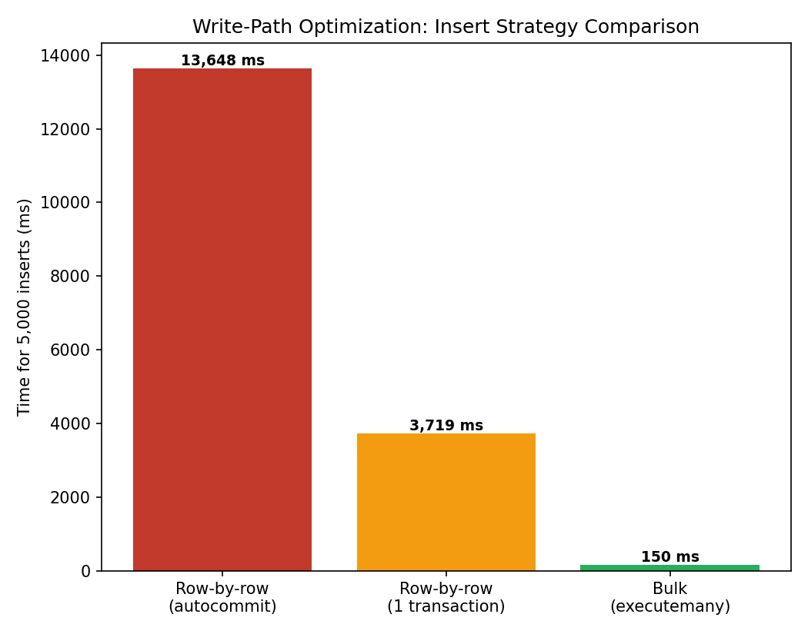
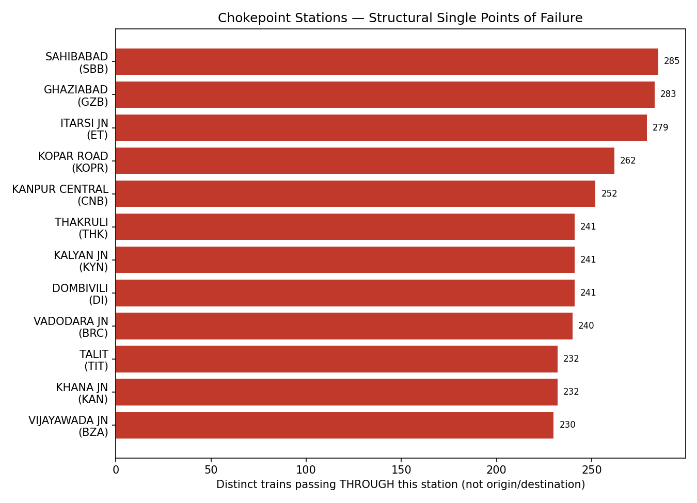
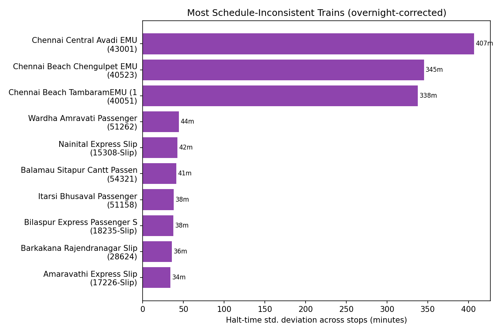
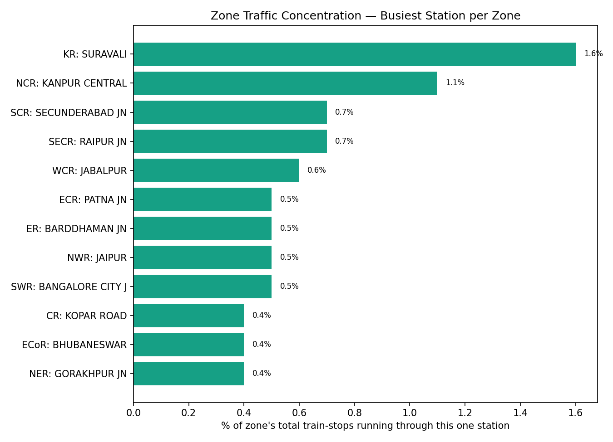
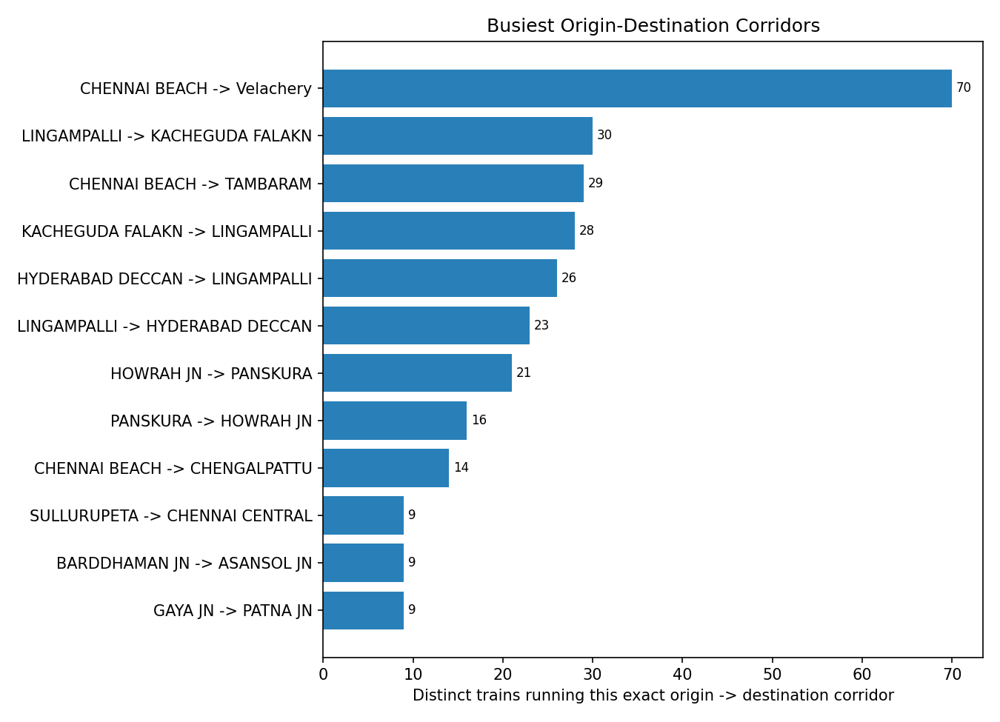
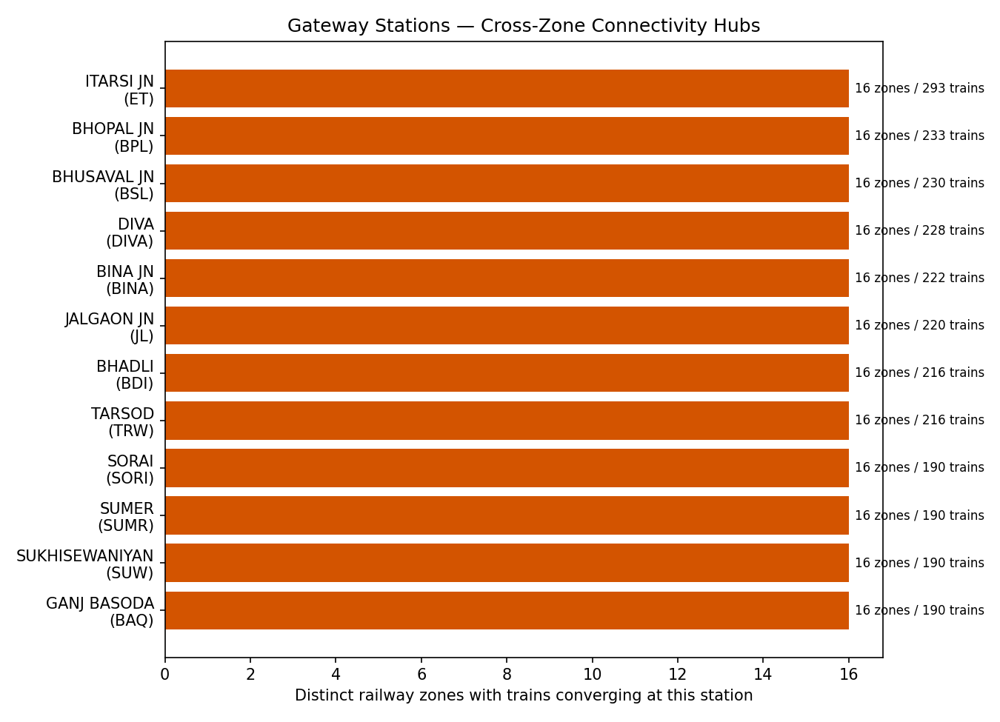

# 🚆 Indian Railways SQL Optimization Project


A query-optimization case study on a real, ~430K-row Indian Railways
dataset (stations, trains, schedules) — diagnosing slow queries with
`EXPLAIN ANALYZE`, fixing them through indexing, query rewriting, and
a materialized-view simulation, and measuring the before/after impact
with a reproducible benchmark harness.

**TL;DR:** 7 real queries, each timed cold and hot (median of 5 runs),
speedups from 1.1x up to **183x**, with every `EXPLAIN ANALYZE` plan
and every query committed to this repo.

## Table of Contents

- [Dataset](#dataset)
- [Schema](#schema)
- [Data Quality Notes](#data-quality-notes)
- [Optimization Techniques Covered](#optimization-techniques-covered)
- [Setup](#setup)
- [Why These Queries](#why-these-queries)
- [What This Project Does Not Model](#what-this-project-does-not-model)
- [Results — Query Case Studies](#results--query-case-studies)
- [Write-Path Optimization](#write-path-optimization-bulk-vs-row-by-row-insert)
- [Insights & Network Analysis](#insights--network-analysis)
- [Frontend Dashboard](#frontend-dashboard)
- [Presentation](#presentation)
- [Reproducing](#reproducing)

## Project Structure

```
railways-sql-optimization/
├── sql/schema.sql              # raw, unindexed table definitions
├── convert.py                  # GeoJSON -> flat CSV converter
├── queries/                    # query{1-7}_{before,after}.sql
├── plans/                      # EXPLAIN ANALYZE output, one file per query per state
├── benchmark/                  # results.json, write_path_results.json, insights.json
├── charts/                     # generated PNG charts (this README embeds them)
├── frontend/app.py             # Streamlit dashboard (benchmarks, insights, live lookup)
├── presentation/index.html     # self-contained slide-deck walkthrough
└── scripts/
    ├── run_all.py               # orchestrates all 7 case studies end-to-end
    ├── insights.py              # chokepoint/instability/zone/corridor/gateway queries
    ├── make_chart.py            # regenerates benchmark charts
    ├── make_insight_charts.py   # regenerates insight charts
    ├── make_presentation.py     # regenerates presentation/index.html
    └── write_path_bench.py      # bulk vs row-by-row insert benchmark
```

## Dataset

Source: Indian Railways public dataset (station list, train list, and
train-schedule/stop data), originally scraped and published as GeoJSON
on Kaggle (mirrors of the datameet/railways project).



- `stations` — 8,990 rows
- `trains` — 5,208 rows
- `schedules` — 417,080 rows (train stop records — one row per train
  per station per stop)

## Schema



`stations` and `trains` are small lookup tables; `schedules` is the
~417K-row fact table where nearly all query and optimization work in
this project happens — every station appears in many schedule rows,
every train runs as many schedule stops, and `schedules` is the
many-to-many join point between them.

## Data Quality Notes

Real, messy, scraped data required active handling rather than a
straight `LOAD DATA INFILE`. Issues found and how they were resolved:

**1. Nested GeoJSON structure**
Both `stations.json` and `trains.json` are GeoJSON `FeatureCollection`s,
not flat tables. Station code/name/state/zone/address live inside a
`properties` object, and coordinates live inside a separate `geometry`
object (`[longitude, latitude]` order). Trains additionally carry a
full route path as a `LineString` of coordinate pairs. A Python
conversion script (`convert.py`) flattens both files into plain CSVs
before loading, splitting `geometry.coordinates` into separate
`latitude`/`longitude` columns for stations, and preserving the full
route path as a JSON-text `route_path` column on `trains` (unused by
current queries, kept for potential future geospatial work).

**2. Inconsistent null representation**
`schedules.json` represents missing arrival/departure times inconsistently
— sometimes as JSON `null`, sometimes as the literal string `"None"`.
Both are normalized to true SQL `NULL` during conversion, rather than
being loaded as the text `"None"`.

**3. Malformed / oversized "code" fields**
Several station and train identifier fields contain corrupted values far
longer than a normal station/train code — for example, one station
`code` value is `"YAKUT PUR(YKA"` instead of a short code, and one
train's `return_train` field contains a leaked HTML fragment
(`Trivandrum Jan Shatabdi" href=/train/13981/1242/59> 12081`), evidence
that the original data was scraped from a webpage and a stray `<a href>`
tag fragment ended up in the field. Rather than truncating or silently
dropping these rows, the affected columns (`code`, `train_number`,
`from_station_code`, `to_station_code`, `return_train`) were sized
generously (`VARCHAR(50)`–`VARCHAR(255)`) to preserve the data as-is,
and the issue is documented here rather than hidden.

**4. Overnight / boundary trains**
Some schedule rows have `NULL` arrival or departure (trains starting or
terminating at a stop), and some trains cross midnight (`day` differs
between a train's origin and destination stop). These are expected,
real characteristics of the data — not bugs — and are handled explicitly
in later queries rather than filtered out.

## Optimization Techniques Covered

- Indexing: single-column, composite, and covering indexes
- Query rewriting: correlated subquery → window function, `IN` vs
  `EXISTS` vs `JOIN`, `SELECT *` vs projected columns, `OFFSET` vs
  keyset pagination
- Materialized-view simulation (MySQL has no native materialized view):
  a scheduled summary table for a read-heavy dashboard query
- Write-path optimization: bulk vs row-by-row insert, transaction
  wrapping

Each technique is benchmarked with a reproducible harness (median of 5
timed runs per query) and documented as problem → before → fix → after.

## Setup

1. `python convert.py` — flattens the raw JSON into `data/*.csv`
2. Copy the CSVs into MySQL's `secure_file_priv` folder
3. Run `sql/schema.sql` — creates the raw, unindexed tables
4. Run `sql/load.sql` — loads and verifies row counts

## Why These Queries

These weren't picked at random — each maps to a real access pattern
this schema would actually see, and together they were chosen to hit
every technique in the list above at least once:

| Query | Real-world analogue |
|---|---|
| Q1 | Station dashboard / ops reporting ("how long do trains halt at each station") — heavy aggregation over the whole fact table, the kind of query a nightly report or admin panel would run |
| Q2 | Passenger-facing search ("what trains pass through my station this morning") — a selective, latency-sensitive lookup, the most common query shape in a real booking/enquiry system |
| Q3 | Analytics ("longest halt per train") — a per-group ranking, the exact shape that tempts people into a correlated subquery in real reporting code |
| Q4 | Catalog/filter query ("stations served by premium trains") — the classic case where the real fix turns out to be a missing index on the join/filter column, not the `IN`/`JOIN` syntax itself |
| Q5 | Any API endpoint returning train details — `SELECT *` is extremely common in real backend code and easy to overlook as a cost |
| Q6 | Any paginated API/UI (train list, search results) — OFFSET pagination is the default nearly every ORM generates, and the one that quietly falls over at scale |
| Q7 | A live dashboard reloading a station-summary aggregate on every page view — the case for a summary table over recomputing |

The two intentionally excluded from the list are: (a) point lookups by
primary key, which are already fast without any of this and wouldn't
demonstrate anything, and (b) full-text train-name search
(`LIKE '%Express%'`), which the README's Optimization Techniques
section flags but isn't benchmarked here — a real fix needs `FULLTEXT`
indexing or an external search engine, not a B-tree prefix index, and
was left as a stated-but-not-implemented case rather than faked.

## What This Project Does *Not* Model

Being direct about the limits of a single-connection, read-optimized
benchmark, since a real railway booking/enquiry system's workload
would stress things this project never touches:

- **Every benchmark here is read-only, single-connection.** All
  timings are one client, one query at a time, on an otherwise idle
  server. A real system would have concurrent readers *and* writers
  hitting `schedules` simultaneously — row-lock contention, gap locks
  from range scans, and replication lag are not exercised anywhere in
  this repo. The reported numbers are best-case latency, not
  throughput under load.
- **Every index added has a write-side cost this project never
  measures.** By the end of the 7 case studies, `schedules` carries
  3 secondary indexes and `trains` carries 2 — each one is extra work
  on every `INSERT`/`UPDATE`/`DELETE` (index maintenance, extra
  B-tree pages, more WAL/redo log volume) and extra disk space. For a
  fact table that's genuinely write-heavy in production (railways
  schedule data changes far less often than it's read, so this
  particular tradeoff would lean read-optimized in real life — but
  that's a judgment call this README hadn't stated explicitly until
  now, not a benchmarked one).
- **The write-path benchmark (bulk vs row-by-row insert) is isolated,
  not concurrent** — it measures one client loading 5,000 rows against
  an unlocked table, not insert throughput while the read queries
  above are also running against the same rows.
- **No connection pooling, replica reads, or caching layer** are
  modeled. A production system would likely put a cache (Redis) or a
  read replica in front of the Q1/Q7-style dashboard queries
  rather than relying solely on the summary-table trick shown in Q7.

The honest scope of this project is: *diagnosing and fixing single-query
latency on a realistic schema*, not capacity planning or
concurrency/throughput engineering for a production system.

## Results — Query Case Studies

Every query below was run on the same MySQL 8.0.37 instance, on the raw
417,080-row `schedules` table (plus the small `stations`/`trains`
lookup tables), with no indexes beyond the primary keys as the
starting point. Each "before" and "after" number is the **median of 5
timed runs**, measured end-to-end (query execution + result fetch)
via a Python harness (`scripts/run_all.py`) so the numbers are
reproducible rather than a single lucky/unlucky run. Full query text
is in [`queries/`](queries/), full `EXPLAIN ANALYZE` output for every
before/after pair is in [`plans/`](plans/), raw timings are in
[`benchmark/results.json`](benchmark/results.json), and the chart
below is generated by `scripts/make_chart.py`.





| # | Query | Technique | Before | After | Speedup |
|---|-------|-----------|-------:|------:|--------:|
| 1 | Average halt time per station | Covering index `(station_code, station_name, arrival, departure)` | 2341 ms | 983 ms | 2.4x |
| 2 | Trains through a station in a time window | Composite index `(station_code, arrival)` | 4.9 ms | 4.4 ms | 1.1x |
| 3 | Longest-halting station per train | Correlated subquery → `RANK() OVER` window function | 600 ms | 3.3 ms | **183x** |
| 4 | Stations served by a Rajdhani/Duronto train | Index on `schedules.train_number` + `JOIN` rewrite | 853 ms | 189 ms | 4.5x |
| 5 | Full train route lookup by origin station | `SELECT *` → projected columns + index | 31 ms | 6.9 ms | 4.4x |
| 6 | Deep pagination into `schedules` | `OFFSET 300000` → keyset (seek) pagination | 268 ms | 2.3 ms | **116x** |
| 7 | Station traffic dashboard aggregation | Materialized-view-style summary table | 3857 ms | 225 ms | **17x** |

### Proof, not just a claim — Q6's actual EXPLAIN ANALYZE

<details>
<summary><b>Before</b> — OFFSET 300000 (click to expand)</summary>

```
-> Limit/Offset: 20/300000 row(s)  (cost=23021 rows=20) (actual time=314..314 rows=20 loops=1)
    -> Index scan on schedules using PRIMARY  (cost=23021 rows=300020) (actual time=0.0911..286 rows=300020 loops=1)
```

MySQL still has to walk **300,020 rows** through the primary key index
before it can throw away the first 300,000 and return the last 20.

</details>

<details>
<summary><b>After</b> — keyset (seek) pagination (click to expand)</summary>

```
-> Limit: 20 row(s)  (cost=42878 rows=20) (actual time=0.0275..0.0512 rows=20 loops=1)
    -> Filter: (schedules.id > 300000)  (cost=42878 rows=212829) (actual time=0.0266..0.0482 rows=20 loops=1)
        -> Index range scan on schedules using PRIMARY over (300000 < id)  (cost=42878 rows=212829) (actual time=0.0248..0.044 rows=20 loops=1)
```

Same index, same table — but `WHERE id > 300000 LIMIT 20` seeks
directly to the right spot instead of scanning past everything before
it: 286 ms → 0.05 ms of actual scan time for the 20 rows returned.

</details>

All other before/after plans are in [`plans/`](plans/) if you want to
check any of the other queries the same way.

### Write-path optimization (bulk vs row-by-row insert)

Beyond the read queries above, `scripts/write_path_bench.py` benchmarks
insert strategy on 5,000 rows (results in
[`benchmark/write_path_results.json`](benchmark/write_path_results.json)):



| Strategy | Time (5,000 rows) | Speedup vs autocommit |
|---|---:|---:|
| Row-by-row, autocommit per insert | 13,648 ms | 1x |
| Row-by-row, wrapped in one transaction | 3,719 ms | 3.7x |
| Bulk multi-row `INSERT` (`executemany`) | 150 ms | **91x** |

Autocommit-per-row pays a full transaction commit (fsync) for every
single row; wrapping the same loop in one transaction removes that
per-row commit cost; and a true bulk insert additionally collapses
5,000 round-trips into a handful of multi-row `INSERT` statements —
which is why `sql/load.sql` uses `LOAD DATA INFILE` rather than
row-by-row inserts for the original 417K-row load.

## Insights & Network Analysis

Beyond optimizing queries, the same dataset was mined for a few honest,
data-backed findings about the network itself (`scripts/insights.py`,
raw output in [`benchmark/insights.json`](benchmark/insights.json)).

### Chokepoint stations (structural single points of failure)

Stations ranked by how many *distinct trains merely pass through* them
(i.e. the station is neither the train's origin nor its destination).
A high count here means many journeys structurally depend on that one
station being operational, even though it's not their starting or
ending point:



| Station | Code | Trains passing through |
|---|---|---:|
| Sahibabad | SBB | 285 |
| Ghaziabad | GZB | 283 |
| Itarsi Jn | ET | 279 |
| Kopar Road | KOPR | 262 |
| Kanpur Central | CNB | 252 |

### Schedule instability (most inconsistent halt times)

For each train, the standard deviation of its own halt time across its
stops — a proxy for scheduling inconsistency (some stops padded
heavily, others barely touched). Note: this required a **second, real
data-quality fix** on top of the ones in the README's Data Quality
Notes — a naive `TIMESTAMPDIFF(SECOND, arrival, departure)` produces
large negative values for any stop where a train's halt straddles
midnight (MySQL `TIME` has no date component, so `23:58 → 00:04` reads
as *negative* six hours instead of positive six minutes). The query
below corrects for that with `MOD(diff + 86400, 86400)` before
aggregating — without it, the "top 5" list was dominated entirely by
this artifact, not real instability:



### Zone traffic concentration

For each railway zone, what share of its total train-stops run through
its single busiest station — a proxy for whether one station is a
bottleneck for its whole zone:



The honest finding here is a **non-finding**: the highest concentration
across all 15 zones checked is only ~1.6% (Suravali in the KR zone).
No zone in this dataset has a single station carrying a disproportionate
share of its traffic — the network is structurally well-distributed by
this measure, which is a real, if less dramatic, result worth reporting
as-is rather than searching for a more dramatic number.

### Busiest origin-destination corridors

Which exact station pairs have the most distinct trains running
directly between them — the routes with the most redundancy/competition,
as opposed to routes served by only one or two trains:



| Route | Trains |
|---|---:|
| Chennai Beach → Velachery | 70 |
| Lingampalli → Kacheguda Falaknuma | 30 |
| Chennai Beach → Tambaram | 29 |
| Kacheguda Falaknuma → Lingampalli | 28 |
| Hyderabad Deccan → Lingampalli | 26 |

The top of this list is dominated by suburban EMU corridors (Chennai,
Hyderabad), not the long-distance expresses that dominate the
chokepoint/gateway lists above — a genuinely different slice of the
network, and a sanity check that the query is measuring what it claims
to (short, high-frequency commuter routes look different from
long-haul trunk routes, as they should).

### Gateway stations (cross-zone connectivity hubs)

Different from the chokepoint metric above (which measures raw
pass-through volume), this measures how many **distinct railway zones**
have trains converging at a station — a proxy for structural
importance to inter-zone travel specifically, not just general traffic:



| Station | Code | Distinct zones | Distinct trains |
|---|---|---:|---:|
| Itarsi Jn | ET | 16 | 293 |
| Bhopal Jn | BPL | 16 | 233 |
| Bhusaval Jn | BSL | 16 | 230 |
| Diva | DIVA | 16 | 228 |
| Bina Jn | BINA | 16 | 222 |

Itarsi, Bhopal, and Bhusaval are well-known real junctions on India's
north-south and east-west trunk routes, which is a reasonable
plausibility check that this query is finding real structural hubs and
not an artifact of the data.

## Frontend Dashboard

A Streamlit dashboard (`frontend/app.py`) turns the static results into
something clickable: benchmark results with sortable tables and
charts, the insight/network analysis above, the write-path
comparison, and a **live Query-2 lookup** (station + time window) that
runs directly against MySQL if a local connection is available —
falling back gracefully to "no DB connection" if not.

```
pip install -r frontend/requirements.txt
streamlit run frontend/app.py
```

Tabs: **Benchmark Results** · **Chokepoint Insights** · **Write-Path** · **Live Lookup**

## Presentation

A self-contained, dependency-free slide deck (`presentation/index.html`)
walks through the problem, method, results, and insights — open it
directly in any browser (arrow keys or the Prev/Next buttons to
navigate). Regenerate it any time with:

```
python scripts/make_presentation.py
```

### Reproducing

```
python scripts/run_all.py            # runs all 7 case studies, writes queries/, plans/, benchmark/results.json
python scripts/insights.py           # runs the network/insight queries, writes benchmark/insights.json
python scripts/make_chart.py         # regenerates the benchmark charts
python scripts/make_insight_charts.py  # regenerates the insight charts
python scripts/write_path_bench.py
python scripts/make_presentation.py  # regenerates presentation/index.html
```
