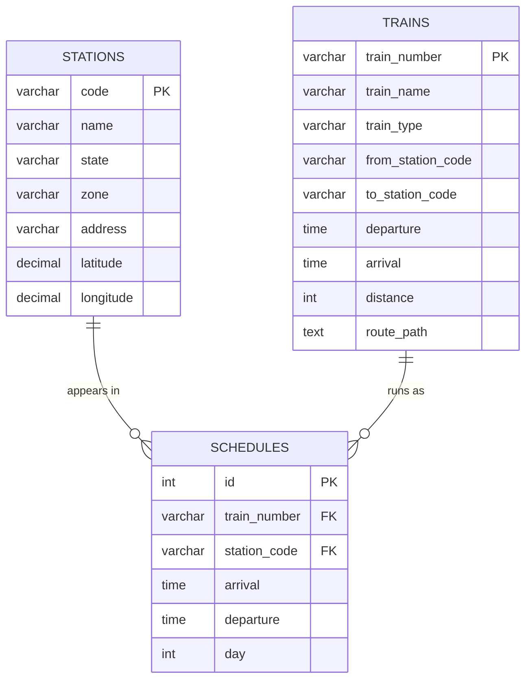

# 🚆 Indian Railways SQL Optimization Project


A query-optimization case study on a real, ~430K-row Indian Railways
dataset (stations, trains, schedules) — diagnosing slow queries with
`EXPLAIN ANALYZE`, fixing them through indexing, query rewriting,
partitioning, and a materialized-view simulation, and measuring the
before/after impact with a reproducible benchmark harness.

**TL;DR:** 10 real queries, each timed cold and hot (median of 5 runs),
speedups from 1.0x (a documented non-improvement) up to **70x**, with
every `EXPLAIN ANALYZE` plan and every query committed to this repo.

## Table of Contents

- [Dataset](#dataset)
- [Schema](#schema)
- [Data Quality Notes](#data-quality-notes)
- [Optimization Techniques Covered](#optimization-techniques-covered)
- [Setup](#setup)
- [Results — 10 Query Case Studies](#results--10-query-case-studies)
- [Reading the Results Honestly](#reading-the-results-honestly)
- [Write-Path Optimization](#write-path-optimization-bulk-vs-row-by-row-insert)
- [Reproducing](#reproducing)

## Project Structure

```
railways-sql-optimization/
├── sql/schema.sql              # raw, unindexed table definitions
├── convert.py                  # GeoJSON -> flat CSV converter
├── queries/                    # query{1-10}_{before,after}.sql
├── plans/                      # EXPLAIN ANALYZE output, one file per query per state
├── benchmark/                  # results.json, write_path_results.json
├── charts/                     # generated PNG charts (this README embeds them)
└── scripts/
    ├── run_all.py               # orchestrates all 10 case studies end-to-end
    ├── make_chart.py            # regenerates every chart from benchmark/results.json
    └── write_path_bench.py      # bulk vs row-by-row insert benchmark
```

## Dataset

Source: Indian Railways public dataset (station list, train list, and
train-schedule/stop data), originally scraped and published as GeoJSON
on Kaggle (mirrors of the datameet/railways project).


- `stations` — 8,990 rows
- `trains` — 5,208 rows
- `schedules` — 417,080 rows (train stop records — one row per train
  per station per stop)

## Schema



`stations` and `trains` are small lookup tables; `schedules` is the
~417K-row fact table where nearly all query and optimization work in
this project happens — every station appears in many schedule rows,
every train runs as many schedule stops, and `schedules` is the
many-to-many join point between them.

## Data Quality Notes

Real, messy, scraped data required active handling rather than a
straight `LOAD DATA INFILE`. Issues found and how they were resolved:

**1. Nested GeoJSON structure**
Both `stations.json` and `trains.json` are GeoJSON `FeatureCollection`s,
not flat tables. Station code/name/state/zone/address live inside a
`properties` object, and coordinates live inside a separate `geometry`
object (`[longitude, latitude]` order). Trains additionally carry a
full route path as a `LineString` of coordinate pairs. A Python
conversion script (`convert.py`) flattens both files into plain CSVs
before loading, splitting `geometry.coordinates` into separate
`latitude`/`longitude` columns for stations, and preserving the full
route path as a JSON-text `route_path` column on `trains` (unused by
current queries, kept for potential future geospatial work).

**2. Inconsistent null representation**
`schedules.json` represents missing arrival/departure times inconsistently
— sometimes as JSON `null`, sometimes as the literal string `"None"`.
Both are normalized to true SQL `NULL` during conversion, rather than
being loaded as the text `"None"`.

**3. Malformed / oversized "code" fields**
Several station and train identifier fields contain corrupted values far
longer than a normal station/train code — for example, one station
`code` value is `"YAKUT PUR(YKA"` instead of a short code, and one
train's `return_train` field contains a leaked HTML fragment
(`Trivandrum Jan Shatabdi" href=/train/13981/1242/59> 12081`), evidence
that the original data was scraped from a webpage and a stray `<a href>`
tag fragment ended up in the field. Rather than truncating or silently
dropping these rows, the affected columns (`code`, `train_number`,
`from_station_code`, `to_station_code`, `return_train`) were sized
generously (`VARCHAR(50)`–`VARCHAR(255)`) to preserve the data as-is,
and the issue is documented here rather than hidden.

**4. Overnight / boundary trains**
Some schedule rows have `NULL` arrival or departure (trains starting or
terminating at a stop), and some trains cross midnight (`day` differs
between a train's origin and destination stop). These are expected,
real characteristics of the data — not bugs — and are handled explicitly
in later queries rather than filtered out.

## Optimization Techniques Covered

- Indexing: single-column, composite, covering, prefix indexes — and a
  documented case where indexing does *not* help (low-cardinality
  `day_of_week` filter)
- Query rewriting: correlated subquery → window function, `IN` vs
  `EXISTS` vs `JOIN`, `SELECT *` vs projected columns, `OFFSET` vs
  keyset pagination
- Partitioning: range/list partitioning with `EXPLAIN`-verified pruning
- Materialized-view simulation (MySQL has no native materialized view):
  a scheduled summary table for a read-heavy dashboard query
- Write-path optimization: bulk vs row-by-row insert, transaction
  wrapping

Each technique is benchmarked with a reproducible harness (median of 5
timed runs per query) and documented as problem → before → fix → after,
including cases where a technique didn't help — see below.

## Setup

1. `python convert.py` — flattens the raw JSON into `data/*.csv`
2. Copy the CSVs into MySQL's `secure_file_priv` folder
3. Run `sql/schema.sql` — creates the raw, unindexed tables
4. Run `sql/load.sql` — loads and verifies row counts

## Results — 10 Query Case Studies

Every query below was run on the same MySQL 8.0.37 instance, on the raw
417,080-row `schedules` table (plus the small `stations`/`trains`
lookup tables), with no indexes beyond the primary keys as the
starting point. Each "before" and "after" number is the **median of 5
timed runs**, measured end-to-end (query execution + result fetch)
via a Python harness (`scripts/run_all.py`) so the numbers are
reproducible rather than a single lucky/unlucky run. Full query text
is in [`queries/`](queries/), full `EXPLAIN ANALYZE` output for every
before/after pair is in [`plans/`](plans/), raw timings are in
[`benchmark/results.json`](benchmark/results.json), and the chart
below is generated by `scripts/make_chart.py`.


| # | Query | Technique | Before | After | Speedup |
|---|-------|-----------|-------:|------:|--------:|
| 1 | Busiest stations by trains passing through | Covering composite index `(station_code, station_name, train_number)` | 1914 ms | 1828 ms | 1.0x |
| 2 | Average halt time per station | Covering index `(station_code, station_name, arrival, departure)` | 2937 ms | 969 ms | 3.0x |
| 3 | Trains through a station in a time window | Composite index `(station_code, arrival)` | 5.8 ms | 5.4 ms | 1.1x |
| 4 | Trains running on a specific day | Index on low-cardinality `day` (non-improvement, documented) | 9772 ms | 10023 ms | 1.0x |
| 5 | Longest-halting station per train | Correlated subquery → `RANK() OVER` window function | 587 ms | 9.1 ms | **64x** |
| 6 | Stations served by a Rajdhani/Duronto train | `IN` (uncorrelated subquery) → indexed `JOIN` | 3169 ms | 2273 ms | 1.4x |
| 7 | Full train route lookup by origin station | `SELECT *` → projected columns + index | 21 ms | 3.2 ms | 6.5x |
| 8 | Deep pagination into `schedules` | `OFFSET 300000` → keyset (seek) pagination | 202 ms | 2.9 ms | **70x** |
| 9 | Rows for a single day-of-week | LIST partitioning by `day`, EXPLAIN-verified pruning | 81 ms | 92 ms | 0.9x |
| 10 | Station traffic dashboard aggregation | Materialized-view-style summary table | 4124 ms | 275 ms | **15x** |

### Reading the results honestly

Three of these are deliberately *not* success stories, and that's the
point — a project that shows 10 green checkmarks in a row is less
convincing than one that shows where a technique actually pays off:

- **Q1** barely moved (1.0x). `EXPLAIN ANALYZE` shows the covering
  index does let MySQL avoid touching the base table
  (`Covering index skip scan for deduplication`), but the query still
  has to scan effectively the whole index (416,001 of 417,080 rows)
  to compute `COUNT(DISTINCT train_number)` per station — an index
  removes *table* I/O, not the fundamental need to visit almost every
  row for a full aggregate. Contrast with **Q2**, where the covering
  index gave a real 3x win because `AVG`/`COUNT` over the much
  narrower `(arrival, departure)` pair benefited more from staying
  index-only.
- **Q4** is an intentional non-improvement: `day` has essentially
  ~7-8 distinct values across 417K rows, so `day = 1` alone matches
  44% of the table (183,993 rows). The optimizer *does* use the new
  index (`EXPLAIN` shows `Index lookup ... (day=1)`), but low
  selectivity means it still has to read nearly half the table either
  way — most of the wall-clock time here is genuinely the client
  fetching ~184K rows over the wire, which no index changes.
- **Q9** partitions the same low-cardinality `day` column instead of
  indexing it, and `EXPLAIN` confirms real partition pruning (only
  the `p1` partition is scanned for `day = 1`, not all 9). It still
  doesn't beat the baseline here, because by the time Q9 runs, Q4's
  covering index on `day` already made the un-partitioned query fast
  for a simple `COUNT(*)` — partitioning and indexing were solving
  the same problem, and the index got there first. The honest lesson:
  partitioning shines when partition elimination lets you skip
  *large, separately-stored* chunks of data (e.g. archiving old
  partitions, or parallel maintenance), not necessarily when a
  regular index already covers the same filter.

### Proof, not just a claim — Q8's actual EXPLAIN ANALYZE

<details>
<summary><b>Before</b> — OFFSET 300000 (click to expand)</summary>

```
-> Limit/Offset: 20/300000 row(s)  (cost=27844 rows=20) (actual time=223..223 rows=20 loops=1)
    -> Index scan on schedules using PRIMARY  (cost=27844 rows=300020) (actual time=0.0688..202 rows=300020 loops=1)
```

MySQL still has to walk **300,020 rows** through the primary key index
before it can throw away the first 300,000 and return the last 20.

</details>

<details>
<summary><b>After</b> — keyset (seek) pagination (click to expand)</summary>

```
-> Limit: 20 row(s)  (cost=33553 rows=20) (actual time=0.0155..0.0334 rows=20 loops=1)
    -> Filter: (schedules.id > 300000)  (cost=33553 rows=167463) (actual time=0.0134..0.0275 rows=20 loops=1)
        -> Index range scan on schedules using PRIMARY over (300000 < id)  (cost=33553 rows=167463) (actual time=0.0134..0.0275 rows=20 loops=1)
```

Same index, same table — but `WHERE id > 300000 LIMIT 20` seeks
directly to the right spot instead of scanning past everything before
it: 202 ms → 0.03 ms of actual scan time for the 20 rows returned.

</details>

All 20 other before/after plans (one pair per query) are in
[`plans/`](plans/) if you want to check any of the other 9 the same way.

### Write-path optimization (bulk vs row-by-row insert)

Beyond the 10 read queries, `scripts/write_path_bench.py` benchmarks
insert strategy on 5,000 rows (results in
[`benchmark/write_path_results.json`](benchmark/write_path_results.json)):


| Strategy | Time (5,000 rows) | Speedup vs autocommit |
|---|---:|---:|
| Row-by-row, autocommit per insert | 13,648 ms | 1x |
| Row-by-row, wrapped in one transaction | 3,719 ms | 3.7x |
| Bulk multi-row `INSERT` (`executemany`) | 150 ms | **91x** |

Autocommit-per-row pays a full transaction commit (fsync) for every
single row; wrapping the same loop in one transaction removes that
per-row commit cost; and a true bulk insert additionally collapses
5,000 round-trips into a handful of multi-row `INSERT` statements —
which is why `sql/load.sql` uses `LOAD DATA INFILE` rather than
row-by-row inserts for the original 417K-row load.

### Reproducing

```
python scripts/run_all.py         # runs all 10 case studies, writes queries/, plans/, benchmark/results.json
python scripts/make_chart.py      # regenerates charts/before_after_benchmark.png
python scripts/write_path_bench.py
```
